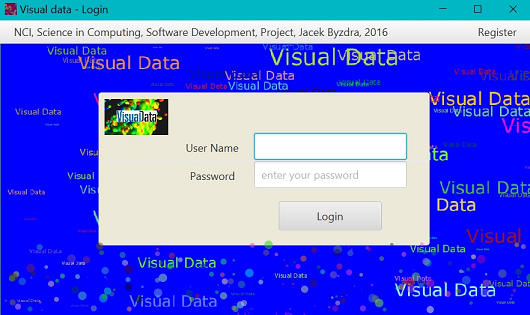
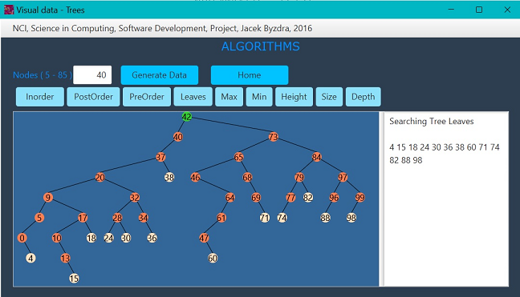
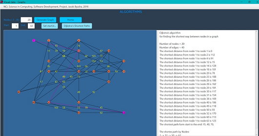

# VisualDataJB
# Data Structure Visualization and Algorithm Animation in Java, author: Jacek Byzdra, email: jacekbwwa@gmail.com

# Description
The project presents an interactive software application designed for visualization of commonly used data structures and algorithms.  
The system displays data structures and algorithms graphically providing visualization and animation of the researched structure.   
One of the application feature is animation of used algorithms.   
The tool implements interactive feature that allows user to change methods, and data to trace, and compare efficiency of different algorithms, and show data structures.  
Following data structures are  illustrated in  a graphical, visual, interactive, and animation way:    
- Binary Search Tree   
- Graphs  
Following sorting algorithms  are presented in a graphical, visual, interactive, and animation way:  
- Bubble Sort  
- InsertionSort  
- Selection Sort  
- Merge Sort  
- Quick Sort  
- Heap Sort  

## Welcome part
- The Welcome page of the application presents in animation way the logo of the system . User may login to the system  or register if the login was not created before. The database of users was created in MySQL database.  For the presentation user may login with no entrance  the user name and password.  

## First Part
- The first part and second  presents visuallisation and animation of different sorting methods. In the first part of the application use may provide up to 1000 numbers represented by graphical bars,  and observe performance of the algorithms.  

## Second Part
- In the second part of the application user may provide up to 46 numbers represented by  graphical panels,  enhanced in the sorting speed slider control, and measure time of performed methods. System shows how different methods of sorting are performed, and compare time of it peformance.  

## Third Part
- The third part of the applcation presents visualization of Binary Search Tree structure. This application creates, from number pooled by user, the graphical structure of the BST tree with nodes. User may perform different search methods on the tree , and system displays in graphical form and text form the found solution.  

## Fourth Part
- The fourth part of the application presents visualization of Graph structure. The application creates, from number pooled by user, the graphical structure of Graph with nodes and edges.User may mark start and end node in created Graph and search the shortest path ways according to Dijkstra's algorithm.  System displays in graphical and text form the found shortest path ways, and nodes on the paths.  
- The enhancement of the system is presentation of the text information for different  algorithms. System displays the notes after choosed button is invoked by the user.

## Fifth Part
- The fifth part of the system was designed to provide interactive multiple questions/answers quiz based on algorithms and data structures.  System will evaluate user’s answers,  and in response will show correct answers and sum of received points. The list of the questions and answers is recorded in MySQL database.  

## Technologies Used
- Java
- JavaFX
- MySQL
- CSS

## Code Explaination
- See ProjectTechnicalReport_Jacek Byzdra_x15030491.pdf

# How to run 
**Compiling with IDE**   

- Clone the repository
- Open the folder on IDE
- Compile project
- run  the scripts visualDataJB.sql  in MySQL
- Execute on IDE   

**Running with self executing jar**

- run the VisualDataJB-JacekByzdrax15030491.jar file

### Author

**Jacek Byzdra**  
*Software Developer  
jacek.jaroslaw.byzdra@gmail.com  
[Linkedin](https://www.linkedin.com/in/jacek-byzdra/) - [GitHub](https://github.com/jacekbwwa)*

### License
This work is available under a Creative Commons License Attribution - Non-Commercial Use - No Derivative Works 4.0 International

